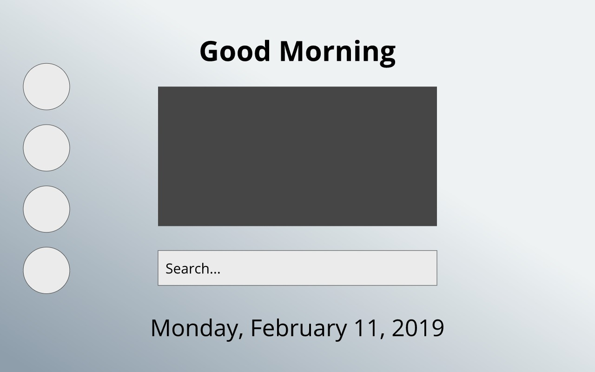

# #Mood

## Proposal/Overview
Mood is a Mozilla Firefox extension that allows users to open new tabs/windows and see a GIF that describes the weather and the day.

### UI Design


## Getting Started

### To download file from terminal:

```
git clone https://github.com/nyu-ossd-s19/mood.git
```

<!-- ### To download file from zip -->

### To install file into Firefox:

1. Open Firefox app
2. Go to "about:debugging" in Firefox, click "Load Temporary Add-on" and select any file in your the `mood` directory

_The extension will be installed, and will stay until you restart Firefox._

## Testing

Open a new tab in the same Firefox window you loaded the extension into.

## License

You can view the license this project is under by going [here](/license.md).

## Contributing

Want to contribute to this open source project? Go [here](/contributing.md) to find our contribution guidelines.